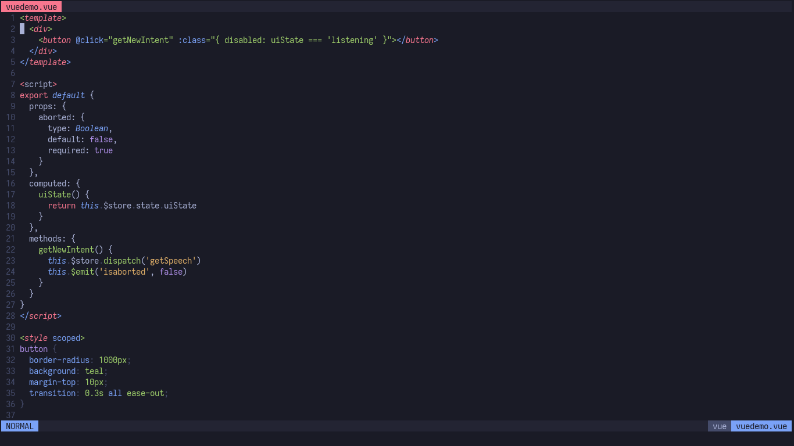
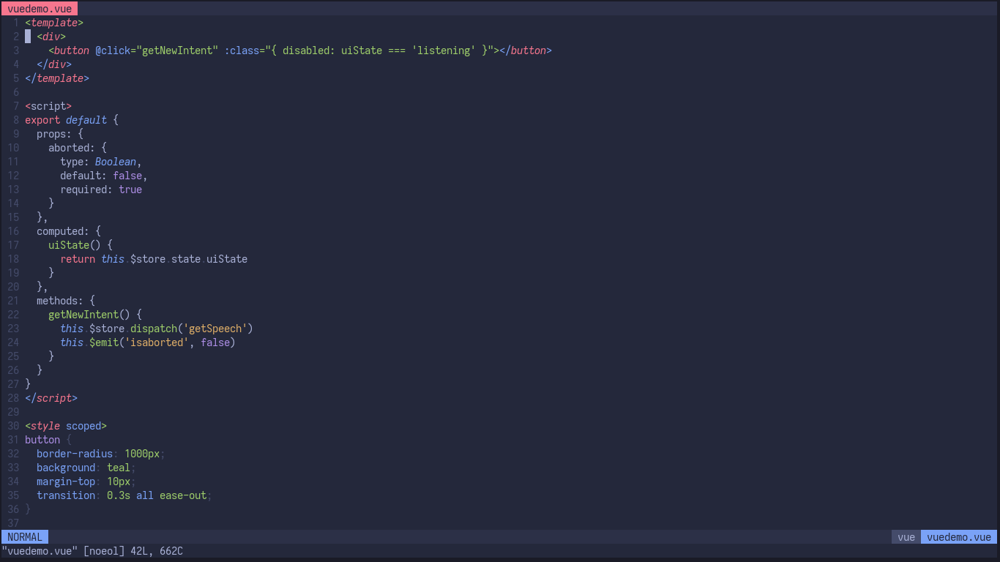

<p align="center">
	
</p>

<h2 align="center">night</h2>
<p align="center">
	
</p>

<h2 align="center">storm</h2>
<p align="center">
	
</p>

### About

Originally by [enkia](https://github.com/enkia/tokyo-night-vscode-theme)

A clean, dark vim theme that celebrates the lights of downtown Tokyo at night based on a VS Code theme with the same name

now come with two variants, `night` and `storm`. The only difference is the background color, where the `storm` variant gets a lighter color

this colorscheme works best with [vim-polyglot](https://github.com/sheerun/vim-polyglot). Please install it first

## this colorscheme only support true colors!

### Features

- Support for numerous file types and plugin
- Customizable
- [Italic support](https://github.com/sainnhe/icursive-nerd-font)

### Installation

Using [vim-plug](https://github.com/junegunn/vim-plug)

```vim
Plug 'ghifarit53/tokyonight.vim'
```

add this to your .vimrc

```vim
set termguicolors

let g:tokyonight_style = 'night' " available: night, storm
let g:tokyonight_enable_italic = 1
let g:tokyonight_disable_italic_comment = 1

colorscheme tokyonight
```

if `g:tokyonight_style` isn't specified, the default `night` variant will be used

### Lightline

this theme also has support for [lightline](https://github.com/itchyny/lightline.vim)

```vim
let g:lightline = {'colorscheme' : 'tokyonight'}
```

### Port

- [Alacritty](https://github.com/zatchheems/tokyo-night-alacritty-theme) by [zatchheems](https://github.com/zatchheems)

.Xresources file available if you want to port it<br>
Tell me if you made a port and i'll list them here<br>

### Credits

- [Sainnhe](https://github.com/sainnhe) for the color template file
- [Enkia](https://github.com/enkia) for the color palettes

### License

[MIT](./LICENSE) © Ghifari Taqiuddin
